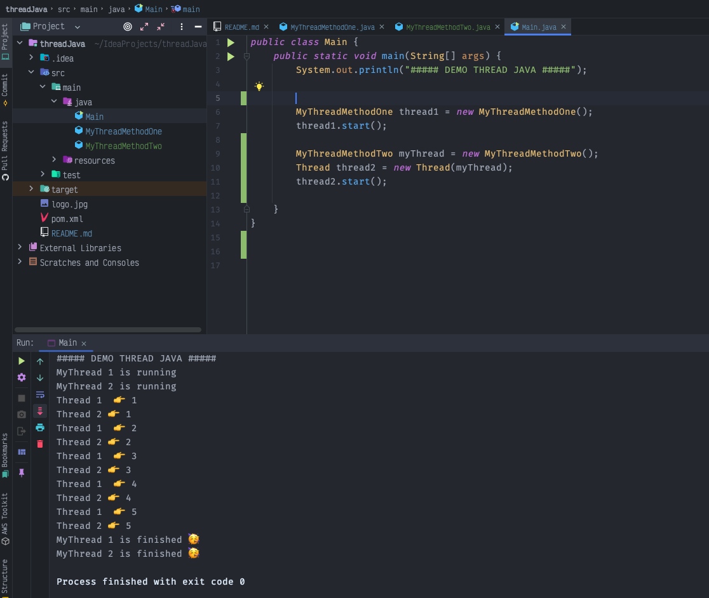

 

    
     
     
    <h1 align="center">Java MultiThreading</h1>

  

    Demo and understanding
     
     
  

 
 

<!-- TABLE OF CONTENTS -->

  
Table of Contents

  <ol>
    <li><a href="#illustration">Illustration</a></li>
    <li><a href="#description">Description</a></li>
    <li><a href="#languages">Languages & tools</a></li>
    <li><a href="#objectives">Objectives</a></li>
    <li><a href="#setup">SetUp</a></li>
    <li><a href="#status">Status</a></li>
    <li><a href="#context">Context</a></li>
  </ol>

 
 

## ✨ Illustration 

## 🗒 Description 
Small project to understand how multithreading works in Java by creating 2 threads.
Multithreading :
* Process of executing multiple threads simultaneously 
* Helps maximum utilization of CPU
* Threads are independent, don't affect the execution of other threads
* Exception in one thread doesn't interrupt other threads
* Useful for serving multiple clients, multiplayer games ...

## 🛠 Languages/tools 
- Java

## 🎯 Objectives 
- **Understand mechanism of threads**
- **Understand the two ways of creating threads**
  - extends Thread class
  - implements Runnable interface
- **Understand the difference between start() and run() methods**
  - start() method starts multiple threads
  - run() method only executes one thread
- **Which one is better ?**
  - _major advantage_ of using **implements Runnable interface**
    - More FLEXIBILITY
    - Java doesn't support multiple inheritance 
    - => using **implements** make **extends** usable

## 🎯 SetUp 
- How to launch React Sudoku
    - `git clone`
    - `cd java-multithreading`
    - `mvn clean install`
    - `mvn exec:java -Dexec.mainClass="com.multithreading.Main"`

## 📈 Status 

Project finished

## 🗓 Context 
I realized this practical work during my bachelor of computer science in the Institute of technology of Vannes

